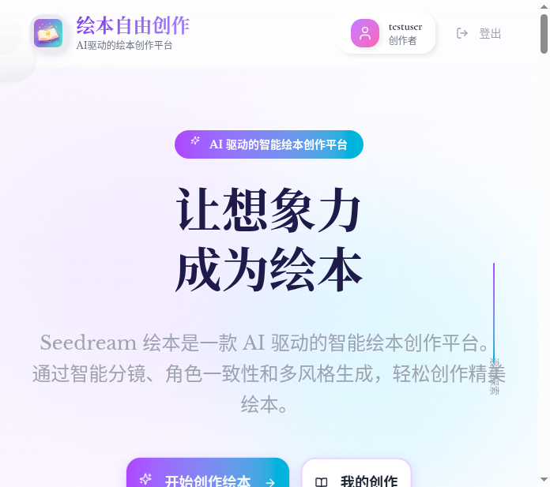

<div align="center">


# Seedream — AI 儿童绘本创作平台

**输入一个主题，AI 生成完整故事 + 15 种风格插画 + 翻页式预览 + PDF 导出**

[](https://generate-huiben.onrender.com)
[](https://github.com/ElijahZhao/seedream-HuiBenShengCHENG/actions)
[](LICENSE)

[](https://nextjs.org)
[](https://react.dev)
[](https://www.typescriptlang.org)
[](https://tailwindcss.com)
[](https://supabase.com)

<p>
  <b>English</b> | <a href="README.zh-CN.md">中文</a>
</p>

</div>



<br/>

## Why Seedream?

Most AI image generators produce single images. Seedream creates **complete picture books** — with coherent storylines, consistent characters, scene-by-scene storyboards, and professional layouts. One theme in, a finished book out.

## Creation Workflow

```
💡 Theme Input  →  📝 AI Story  →  🎭 Characters  →  🎬 Storyboard  →  🎨 Illustrations  →  📖 Preview & Export
```

| Step | What Happens | Time |
|:---:|---|---|
| **1. Create** | Enter a theme or Chinese idiom — AI generates a full story with characters and scenes | ~5s |
| **2. Characters** | Review AI-designed character profiles (name, appearance, personality) | Instant |
| **3. Storyboard** | Edit AI-generated scene descriptions, narration, and shot types | As needed |
| **4. Generate** | AI illustrates each scene in your chosen art style (up to 5 in parallel) | ~2-3 min |
| **5. Preview** | Flip through your book page-by-page, then export to PDF or save to cloud | Instant |

## Key Features

### AI Story Engine
- **Chinese Idiom Recognition** — Input idioms like "程门立雪" and AI preserves the original tale's characters, plot, and moral
- **Age-Appropriate Content** — Stories adapt to target age group (3-5, 6-8, 9-12)
- **Rich Scene Descriptions** — 80+ word visual prompts per scene, optimized for illustration generation

### 15 Art Styles

| Style | Style | Style |
|:---:|:---:|:---:|
| 🎨 Watercolor | 🌸 Ukiyo-e | ✏️ Pencil Sketch |
| 🌸 Anime | 🖼️ Oil Painting | 🖍️ Colored Pencil |
| 🏺 Clay 3D | ✂️ Paper Cut | 🪨 Mineral Pigment |
| 🎨 Pastel | 🔷 Vector | 📺 Retro |
| 💥 Pop Art | 🧩 Collage | 📐 Flat Design |

### Technical Highlights
- **Parallel Generation** — Up to 5 images generated simultaneously
- **PDF Export** — Native jsPDF rendering (no html2canvas), compact file size
- **Cloud Sync** — Supabase PostgreSQL with Row-Level Security
- **Offline Fallback** — IndexedDB + localStorage when cloud is unavailable
- **Playful Animations** — CSS-only breathing, bounce, and float animations for child-friendly UX
- **Multi-Platform** — Web, Windows, macOS, Android

## Quick Start

### Try Online (Recommended)

> No download, no API key setup — just open and create.

**[Generate your first picture book now →](https://generate-huiben.onrender.com)**

### Local Development

```bash
git clone https://github.com/ElijahZhao/seedream-HuiBenShengCHENG.git
cd seedream-HuiBenShengCHENG
pnpm install
pnpm dev
```

### Environment Variables (Optional)

The app works out of the box with built-in credentials. Override only if you want your own backend:

| Variable | Description |
|:---|:---|
| `NEXT_PUBLIC_SUPABASE_URL` | Your Supabase project URL |
| `NEXT_PUBLIC_SUPABASE_ANON_KEY` | Your Supabase anonymous key |

## Tech Stack

| Layer | Technology |
|:---|:---|
| Framework | Next.js 16 + React 19 + TypeScript 5 |
| UI | shadcn/ui + Tailwind CSS v4 + tw-animate-css |
| Database | Supabase PostgreSQL (RLS) |
| Auth | Supabase Auth (email/password) |
| AI Text | ByteDance Ark — doubao-seed-2-0-mini |
| AI Image | ByteDance Ark — doubao-seedream-5-0 |
| PDF | jsPDF (native rendering) |
| Desktop | Tauri 2 (Rust) |
| Mobile | Capacitor 8 |
| Hosting | Render • CI/CD via GitHub Actions |

## Project Structure

```
src/
├── app/                  # Next.js App Router
│   ├── page.tsx          # Landing page
│   ├── create/           # Story creation form
│   ├── characters/       # Character review
│   ├── storyboard/       # Editable storyboard
│   ├── generating/       # Parallel image generation
│   ├── preview/          # Book reader + PDF export
│   ├── my-works/         # Cloud library
│   ├── login/  register/ # Auth pages
│   └── api/              # Backend API routes
├── components/           # Reusable UI (shadcn/ui + custom)
└── lib/                  # Core logic
    ├── supabaseClient.ts # Supabase config
    ├── volcengine.ts     # ByteDance Ark API
    ├── db.ts             # Database layer
    ├── localAuth.ts      # Auth module
    └── styleConfig.ts    # 15 art style definitions
```

## Download

| Platform | Link |
|:---|:---|
| 🌐 Web | [generate-huiben.onrender.com](https://generate-huiben.onrender.com) |
| 🖥️ Windows / 🍎 macOS / 📱 Android | [Releases](https://github.com/ElijahZhao/seedream-HuiBenShengCHENG/releases) |

## Contributing

1. Fork the repository
2. Create your feature branch (`git checkout -b feature/amazing-feature`)
3. Commit (`git commit -m 'Add amazing feature'`)
4. Push (`git push origin feature/amazing-feature`)
5. Open a Pull Request

## License

[MIT](LICENSE) © 2026 Seedream

---

<div align="center">
Built with <a href="https://nextjs.org">Next.js</a> + <a href="https://supabase.com">Supabase</a> + <a href="https://www.volcengine.com/product/doubao">ByteDance Doubao Seed</a><br/>
Made with ❤️ by <a href="https://github.com/ElijahZhao">Elijah Lin</a>
</div>